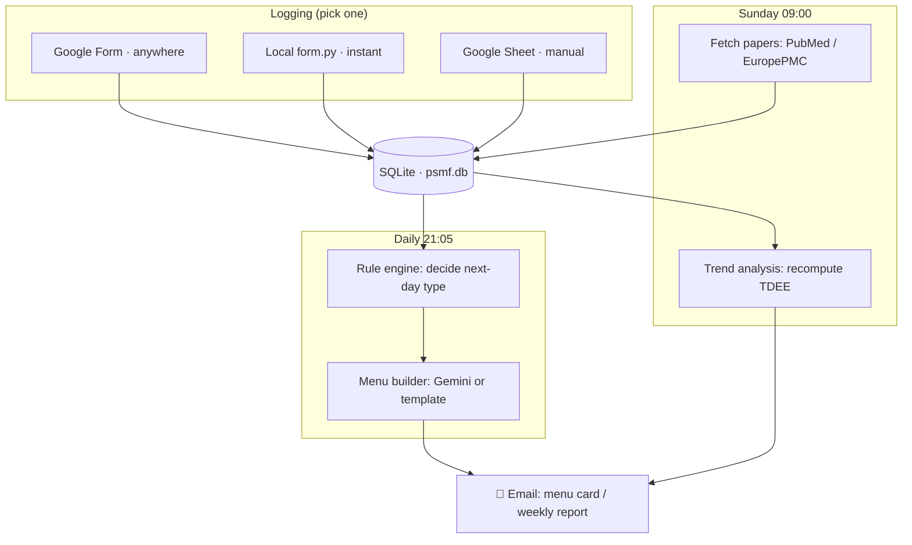
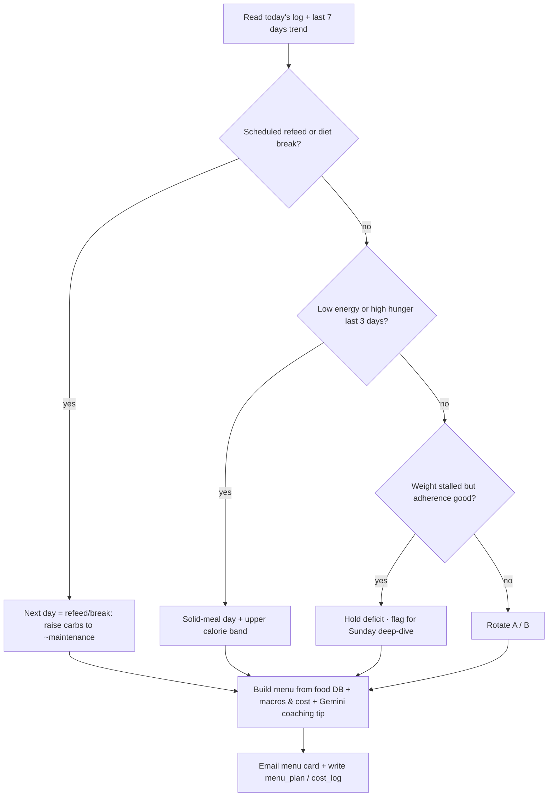
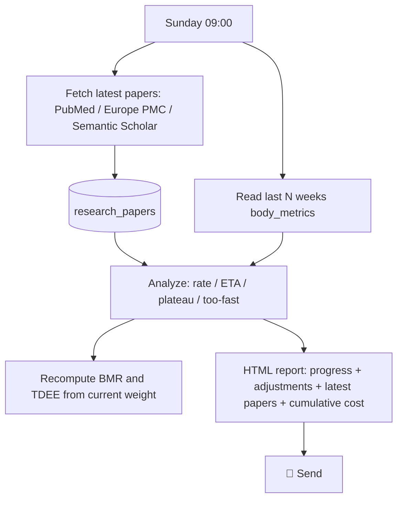
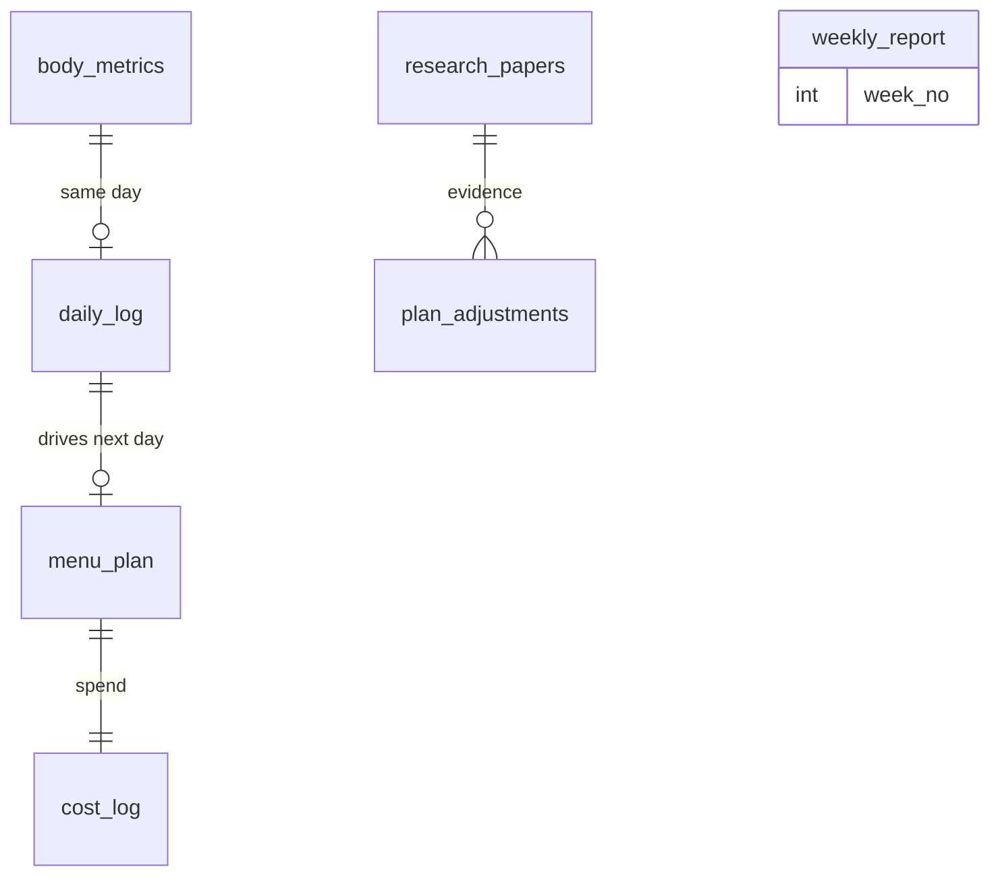

<p align="center"></p>

<p align="center">
  <a href="LICENSE"></a>
  <a href="https://github.com/Lee-unhn/psmf-coach/releases"></a>
  
  
</p>

<p align="center"><b>English</b> | <a href="README.md">中文</a></p>

# PSMF-Coach 🥗

> A self-hosted, zero-monthly-cost automation template for running a **PSMF (Protein-Sparing Modified Fast)**.
> Log your daily metrics → get a fully-detailed **next-day menu card** emailed to you; every Sunday it auto-fetches the latest research, analyzes your trend, recomputes TDEE, and emails a weekly report.
> Pure Python, free APIs only (PubMed/Europe PMC for papers, Gemini free tier, Gmail SMTP, Windows Task Scheduler).

---

## ⚠️ Medical Disclaimer (read first)

PSMF is a **very-low-calorie diet (VLCD)** — one of the most aggressive fat-loss protocols. The most common serious risk is **electrolyte imbalance causing cardiac arrhythmia**, not hunger.

- This project is an **educational/informational tool, NOT medical advice**.
- **Consult a physician and get baseline bloodwork** before starting (kidney/liver/glucose/electrolytes/thyroid/uric acid/lipids/ECG).
- Electrolytes (sodium/potassium/magnesium) are a **daily requirement** here, never optional.
- Stop immediately and seek care for any warning sign (palpitations, dizziness, severe weakness, chest tightness).
- The authors accept no liability. **Use at your own risk.**

---

## ✨ Features

- **Automatic phase progression** — as weight drops, auto-advances ATTACK → CRUISE → STABILIZE → MAINTAIN, **ramping calories/carbs up** (thresholds relative to your goal weight) + training block scales with phase.
- **Daily research finding** — each menu email includes one authoritative paper of the week (peer-reviewed sources, rotates daily).
- **Self-learning preferences** — learns your most-adhered / cheapest / most-planned menus from history (menus + adherence + cost) and biases future solid days toward your best-adhered variant; surfaced in the weekly report.
- **Dynamic daily menu** — builds the next day's menu from your previous-day data + recent trend, with per-item macros + cost; higher phases auto-fill carbs/fat to target.
- **Full menu-card email** — target vs achieved, per-meal breakdown, supplement schedule, 💰 daily spend, 🚨 red-flag self-check, training note, one-tap "log today" button. Mobile-friendly.
- **Three logging methods** (mix freely): Google Form (anywhere) / local web form (instant) / Google Sheet (manual).
- **Weekly research update** — auto-fetches latest PubMed + Europe PMC papers into SQLite, analyzes trend (rate / ETA / plateau / too-fast), recomputes BMR/TDEE from current weight, emails an HTML report (with cumulative cost).
- **18-week calendar + shopping list** — one-command generation (refeed days + diet break marked).
- **Fully automated** — Windows Task Scheduler (daily 21:05 + Sunday 09:00).

---

## 🏗️ Architecture

Interactive version (5 tabs incl. mind map): [`docs/architecture.html`](docs/architecture.html). Static diagrams below render on GitHub.

### System overview



### Daily dynamic-menu rule engine



### Weekly research + trend analysis



### Database schema (v1)



Stack: Python 3.12 / SQLite / urllib (papers, zero deps) / gspread (optional) / google-genai (optional) / smtplib.

---

## 🚀 Quick start

```bash
git clone https://github.com/Lee-unhn/psmf-coach.git
cd psmf-coach
python -m venv .venv
.venv\Scripts\activate          # Windows
pip install -r requirements.txt # only needed for live integrations; demo runs without

cp .env.example .env            # then edit .env with your data
python init_baseline.py         # create DB + write your baseline
python daily_job.py --dry-run   # run the full "generate next-day menu" flow on sample data
```

Runs with zero keys: menu uses templates, Sheet uses a mock, email is saved to disk instead of sent. Add keys to `.env` and it auto-upgrades — no code changes.

---

## ⚙️ Configuration

Put your data and keys in `.env` (see `.env.example`). How to obtain each service: [`SETUP.md`](SETUP.md).

| To enable | `.env` keys |
|---|---|
| Correct calories for you | body data (SEX/AGE/HEIGHT/START_WEIGHT…) |
| Menu variety (coaching tip) | `GEMINI_API_KEY` |
| Email menu / weekly report | `GMAIL_ADDRESS` + `GMAIL_APP_PASSWORD` |
| Log via Google Form | `SHEET_ID` + `SHEET_LOG_TAB` + `FORM_FILL_URL` (form steps in SETUP.md) |

---

## 📲 Three ways to log

1. **Google Form (recommended, log anywhere)** — steps in SETUP.md. Responses land in your Sheet → the 21:05 job reads them → emails the menu.
2. **Local web form (instant)** — `python form.py` → open `http://<your-LAN-IP>:8765` on phone/PC → submit → menu emailed immediately. Auto-start on boot: `python install_autostart.py` (Windows).
3. **Google Sheet (manual)** — add a row to the response tab.

---

## ⏰ Scheduling (Windows)

```powershell
$py="C:\path\to\psmf-coach\.venv\Scripts\python.exe"; $dir="C:\path\to\psmf-coach"
$s=New-ScheduledTaskSettingsSet -StartWhenAvailable
Register-ScheduledTask -TaskName "PSMF-Daily"  -Action (New-ScheduledTaskAction -Execute $py -Argument "daily_job.py"  -WorkingDirectory $dir) -Trigger (New-ScheduledTaskTrigger -Daily -At 9:05PM) -Settings $s -Force
Register-ScheduledTask -TaskName "PSMF-Weekly" -Action (New-ScheduledTaskAction -Execute $py -Argument "weekly_job.py" -WorkingDirectory $dir) -Trigger (New-ScheduledTaskTrigger -Weekly -DaysOfWeek Sunday -At 9:00AM) -Settings $s -Force
```

---

## 📁 Project structure

| File | Role |
|---|---|
| `config.py` | Config (reads .env) / BMR·TDEE / day-type targets / supplement & red-flag lists |
| `db.py` | SQLite schema (v1, CHECK constraints + version migration) + access |
| `foods.py` | Food DB (macros + price). **Taiwan convenience-store/Costco estimates — localize for your region.** |
| `rule_engine.py` | Decide next-day type from log + trend |
| `menu_generator.py` | Full menu (built from food DB + optional Gemini tip) |
| `training_plan.py` | Home dumbbell training rotation |
| `emailer.py` | Menu card + weekly report HTML email (SMTP) |
| `sheets.py` | Google Form/Sheet reader (gviz CSV; auto-maps localized question titles) |
| `research.py` | Fetch PubMed / Europe PMC / Semantic Scholar |
| `weekly_analysis.py` | Weekly trend + TDEE recompute + adjustment suggestions |
| `daily_job.py` / `weekly_job.py` | Daily / weekly scheduler entry points |
| `form.py` | Local web logging form |
| `make_docs.py` | Generate 18-week calendar + shopping list |
| `verify_setup.py` | One-shot check of Gemini/Gmail/Sheet wiring (never prints keys) |

---

## 🌏 Localization

`foods.py` and supplement prices are **Taiwan-specific** (PX Mart / 7-11 / Costco, NT$). For other regions, edit the items, macros, prices in `foods.py` and `config.SUPPLEMENT_PLAN`.

## 🔒 Privacy

`.env`, `credentials/`, and `data/` (DB + health data) are all in `.gitignore`. This repo contains no personal data or secrets.

## Author

Leeunhn · <a2264563@gmail.com> · GitHub [@Lee-unhn](https://github.com/Lee-unhn)

## License

MIT (with medical disclaimer). See [LICENSE](LICENSE). Copyright © 2026 Leeunhn.
