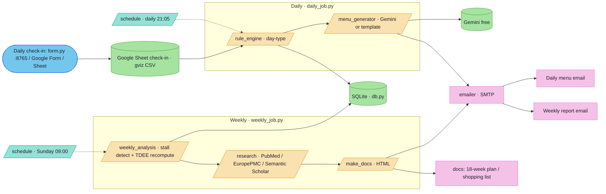

# PSMF-Coach · 個人化 PSMF 減脂教練系統

**English** · [中文說明見下 ↓](#中文說明)

Self-hosted PSMF (Protein-Sparing Modified Fast) diet-coaching automation. You log a
daily check-in (a local form, a Google Form, or a Google Sheet); it generates the next
day's full menu card and emails it to you. Every Sunday it pulls the latest papers +
trends, recomputes your TDEE, and emails a weekly report. Python · SQLite · free APIs.

> Author: **JasonLee** · Template — bring your own data (personal data lives in `data/`, gitignored).

## Architecture



## Quick start (no keys)
```powershell
cd psmf-coach
python init_baseline.py        # build DB + baseline row
python daily_job.py --dry-run  # generate next-day menu from sample data
```

## Modules
| File | Role |
|---|---|
| `config.py` / `db.py` | profile + targets + key loading / SQLite schema (8 tables) |
| `rule_engine.py` | decides next-day type (A / B / refeed / diet-break) from check-in + trend |
| `menu_generator.py` | next-day menu card (Gemini, template fallback) |
| `sheets.py` | Google Sheet read (gviz CSV, no service account) |
| `daily_job.py` | daily orchestration (21:05) → menu email |
| `weekly_analysis.py` / `research.py` / `weekly_job.py` | stall + TDEE recompute / paper fetch / weekly report email (Sun 09:00) |
| `make_docs.py` | 18-week plan + shopping list → `docs/` |
| `form.py` | local check-in form (`http://localhost:8765`) → instant menu |

Setup & keys: [SETUP.md](SETUP.md) · Full plan / evidence: [PSMF-COACH.md](PSMF-COACH.md)

---

## 中文說明

個人化 PSMF（蛋白質節約型減脂）教練系統。每天回填一次（本機表單／Google 表單／Google Sheet），
自動生成**隔日完整菜單卡**並 email 給你；每週日抓最新論文＋趨勢、重算 TDEE、寄**週報**。
Python · SQLite · 全免費 API。

### 功能
- **每日**（21:05）：讀回填 → `rule_engine` 判隔日日型 → `menu_generator`（Gemini／template）→ email 菜單卡（每餐 macros／價格、水分、補劑、紅燈自檢、訓練提示）。
- **每週日**（09:00）：`weekly_analysis` 偵測停滯／減速、重算 TDEE；`research` 抓 PubMed／EuropePMC 論文 → `make_docs` 出 HTML → email 週報。
- **回填三選一**：本機表單 `form.py`（手機同 WiFi 可連）／ Google 表單（隨地填）／ Google Sheet 手動。
- **金鑰**：Gemini（免費，429 自動退 template）、Gmail SMTP 寄信、Google Sheet（gviz CSV 唯讀）。皆放 `~/.claude/secrets/`，`verify_setup.py` 一鍵檢查（不印金鑰值）。

### 隱私
個人健康資料（體重、體脂、菜單紀錄）只存在本機 `data/`（已 gitignore），不進 repo。這是**範本**，請自帶資料。

### 安裝
見 [SETUP.md](SETUP.md)；完整計畫、營養目標、實證依據見 [PSMF-COACH.md](PSMF-COACH.md)。
