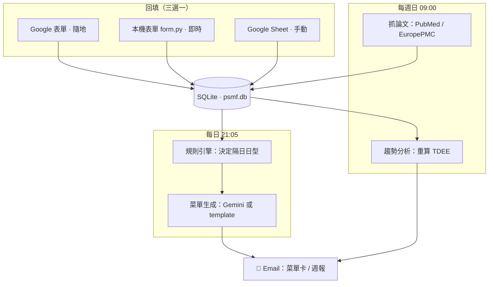
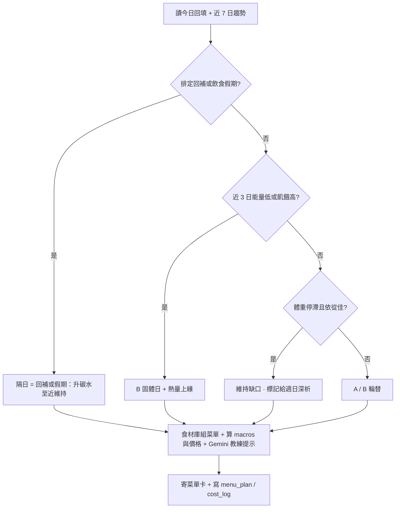
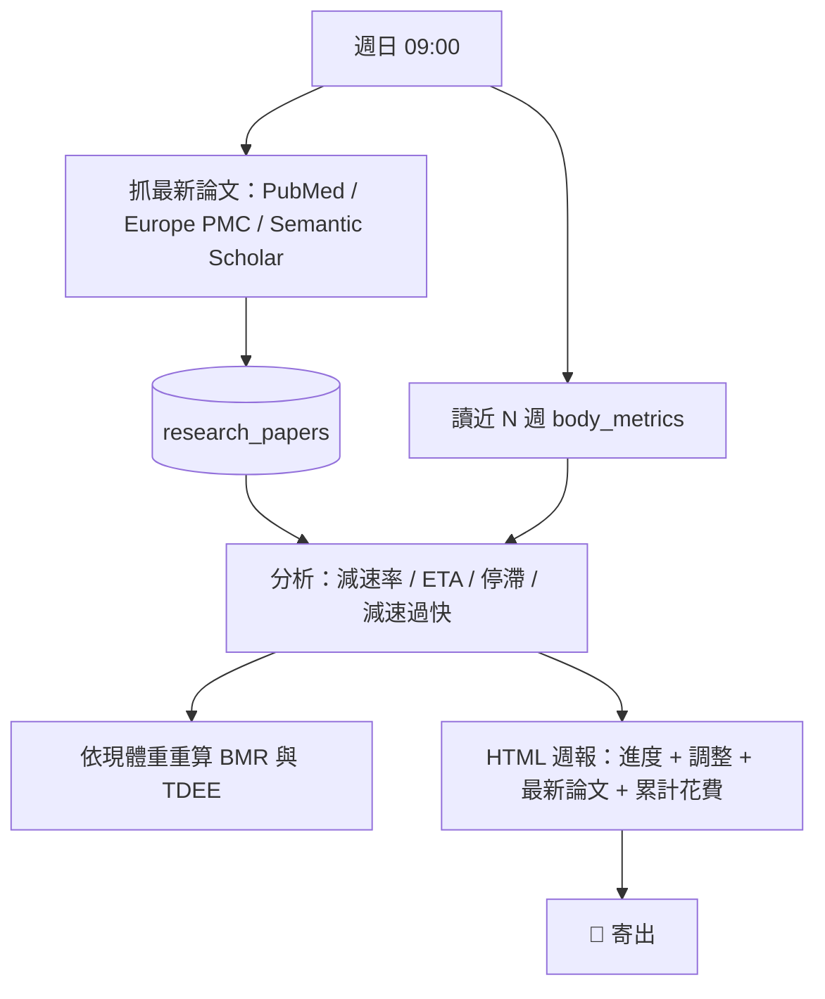
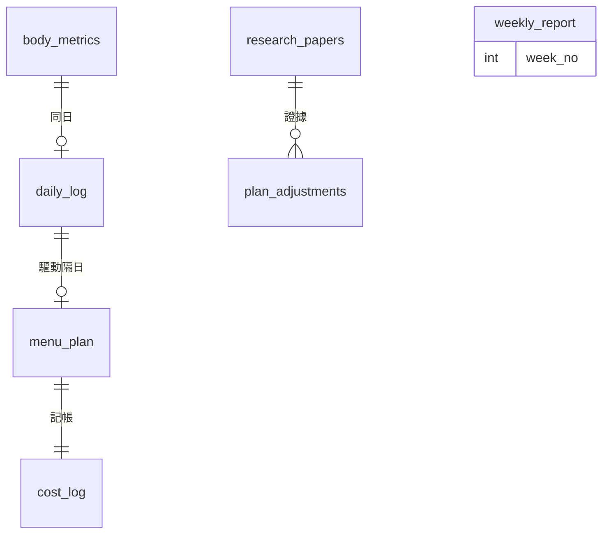

# PSMF-Coach 🥗

> 自動化的 PSMF（蛋白質節約型減脂）個人教練系統範本。
> 每天回填體重/狀態 → 自動產生**隔日完整菜單卡**寄到信箱；每週日自動抓最新研究 + 趨勢分析 + 重算 TDEE + 寄週報。
> 純 Python、零月費（PubMed/Europe PMC 免費抓論文、Gemini 免費額度、Gmail SMTP、Windows 工作排程）。

*A self-hosted, zero-monthly-cost automation template for running a Protein-Sparing Modified Fast. Log your daily data via a Google Form / local form, get a fully-detailed next-day menu emailed to you, and a weekly research + trend report. Python + SQLite, free APIs only.*

---

## ⚠️ 醫療免責聲明（務必先讀）

PSMF 是**極低熱量飲食（VLCD）**，屬醫學界最激進的減脂協議之一。最常見的嚴重風險是**電解質失衡導致心律不整**，不是飢餓。

- 本專案是**衛教/資訊工具，不是醫療建議**。
- 開始前請**諮詢醫師並做基線抽血**（腎/肝/血糖/電解質/甲狀腺/尿酸/血脂/心電圖）。
- 電解質（鈉/鉀/鎂）在本計畫中是**每日必需**，不可省略。
- 任何不適（心悸/暈眩/嚴重無力/胸悶）立即停止並就醫。
- 作者不對任何健康後果負責，**自負風險使用**。

---

## ✨ 功能

- **動態每日菜單**：依「前一日回填 + 近期趨勢」決定隔日日型（全乳清 / 固體餐 / 碳水回補 / 飲食假期），用食材庫算出每餐 macros + 價格。
- **完整菜單卡 email**：目標 vs 達成、三餐明細、補劑時程、💰每日記帳、🚨紅燈自檢、訓練提示、一鍵回填按鈕。手機友善。
- **三種回填方式**（可並存）：Google 表單（隨地）／本機網頁表單（即時）／Google Sheet 手動。
- **每週研究更新**：自動抓 PubMed + Europe PMC 最新論文進 SQLite，Gemini/規則分析趨勢、依現體重重算 BMR/TDEE、偵測停滯/減速過快、寄 HTML 週報（含累計花費）。
- **18 週週曆 + 採購清單**：一鍵產生（標出回補日 + 飲食假期）。
- **全自動**：Windows 工作排程（每日 21:05 + 週日 09:00）。

---

## 🏗️ 架構

互動版（5 分頁，含心智圖）：[`docs/architecture.html`](docs/architecture.html)。以下靜態圖 GitHub 會直接渲染。

### 系統總覽



### 每日動態菜單規則引擎



### 每週研究 + 趨勢分析



### 資料庫 Schema（v1）



技術棧：Python 3.12 / SQLite / urllib（抓論文，零依賴）/ gspread（可選）/ google-genai（可選）/ smtplib。

---

## 🚀 快速開始

```bash
git clone https://github.com/<your-account>/psmf-coach.git
cd psmf-coach
python -m venv .venv
.venv\Scripts\activate          # Windows
pip install -r requirements.txt # 真實串接才需要；純 demo 可略

copy .env.example .env          # 然後編輯 .env 填你的數據
python init_baseline.py         # 建 DB + 寫入你的基線
python daily_job.py --dry-run   # 用範例資料跑「生成隔日菜單」全流程
```

零金鑰也能跑：菜單走 template、Sheet 走 mock、email 存檔不寄。補上 .env 的金鑰即自動升級，程式不用改。

---

## ⚙️ 設定

把你的數據與金鑰填進 `.env`（見 `.env.example` 註解）。各服務取得方式見 [`SETUP.md`](SETUP.md)。

| 想要的功能 | 需要的 .env |
|---|---|
| 算對你的熱量 | 身體數據（SEX/AGE/HEIGHT/START_WEIGHT…）|
| 菜單變化（教練提示） | `GEMINI_API_KEY` |
| 寄菜單 / 週報到信箱 | `GMAIL_ADDRESS` + `GMAIL_APP_PASSWORD` |
| 用 Google 表單回填 | `SHEET_ID` + `SHEET_LOG_TAB` + `FORM_FILL_URL`（建表步驟見 SETUP.md）|

---

## 📲 三種回填方式

1. **Google 表單（推薦，隨地填）**：建表步驟見 SETUP.md。回應進試算表 → 21:05 排程讀取 → email 菜單。
2. **本機網頁表單（即時）**：`python form.py` → 手機/電腦開 `http://<本機IP>:8765` 填 → 立刻 email 菜單。開機自動啟動：`python install_autostart.py`（Windows）。
3. **Google Sheet 手動**：在回應分頁新增一列。

---

## ⏰ 排程（Windows）

```powershell
$py="C:\path\to\psmf-coach\.venv\Scripts\python.exe"; $dir="C:\path\to\psmf-coach"
$s=New-ScheduledTaskSettingsSet -StartWhenAvailable
Register-ScheduledTask -TaskName "PSMF-Daily" -Action (New-ScheduledTaskAction -Execute $py -Argument "daily_job.py" -WorkingDirectory $dir) -Trigger (New-ScheduledTaskTrigger -Daily -At 9:05PM) -Settings $s -Force
Register-ScheduledTask -TaskName "PSMF-Weekly" -Action (New-ScheduledTaskAction -Execute $py -Argument "weekly_job.py" -WorkingDirectory $dir) -Trigger (New-ScheduledTaskTrigger -Weekly -DaysOfWeek Sunday -At 9:00AM) -Settings $s -Force
```

---

## 📁 專案結構

| 檔案 | 角色 |
|---|---|
| `config.py` | 設定（讀 .env）/ BMR·TDEE / 日型目標 / 補劑·紅燈清單 |
| `db.py` | SQLite schema（v1，含 CHECK 約束 + 版本遷移）+ 存取 |
| `foods.py` | 食材庫（macros + 價格，**台灣超商/Costco 估值，請依當地調整**）|
| `rule_engine.py` | 依回填+趨勢決定隔日日型 |
| `menu_generator.py` | 完整菜單（食材庫組出 + Gemini 教練提示）|
| `training_plan.py` | 家用啞鈴重訓循環 |
| `emailer.py` | 菜單卡 + 週報 HTML email（SMTP）|
| `sheets.py` | Google 表單/Sheet 讀取（gviz CSV，中文題目自動對應）|
| `research.py` | 抓 PubMed / Europe PMC / Semantic Scholar |
| `weekly_analysis.py` | 週趨勢 + 重算 TDEE + 調整建議 |
| `daily_job.py` / `weekly_job.py` | 每日 / 每週排程進入點 |
| `form.py` | 本機網頁回填表單 |
| `make_docs.py` | 產生 18 週週曆 + 採購清單 |
| `verify_setup.py` | 一鍵檢查 Gemini/Gmail/Sheet 串接（不印金鑰）|

---

## 🌏 在地化

`foods.py` 與補劑價格是**台灣**情境（全聯/7-11/Costco、NT$）。其他地區請改 `foods.py` 的品項、macros、價格與 `config.SUPPLEMENT_PLAN`。

## 🔒 隱私

`.env`、`credentials/`、`data/`（含 DB 與健康資料）全在 `.gitignore`，不會進 git。本 repo 不含任何個資或金鑰。

## 作者 / Author

Leeunhn · <a2264563@gmail.com> · GitHub [@Lee-unhn](https://github.com/Lee-unhn)

## 授權

MIT（含醫療免責聲明）。見 [LICENSE](LICENSE)。Copyright © 2026 Leeunhn。
