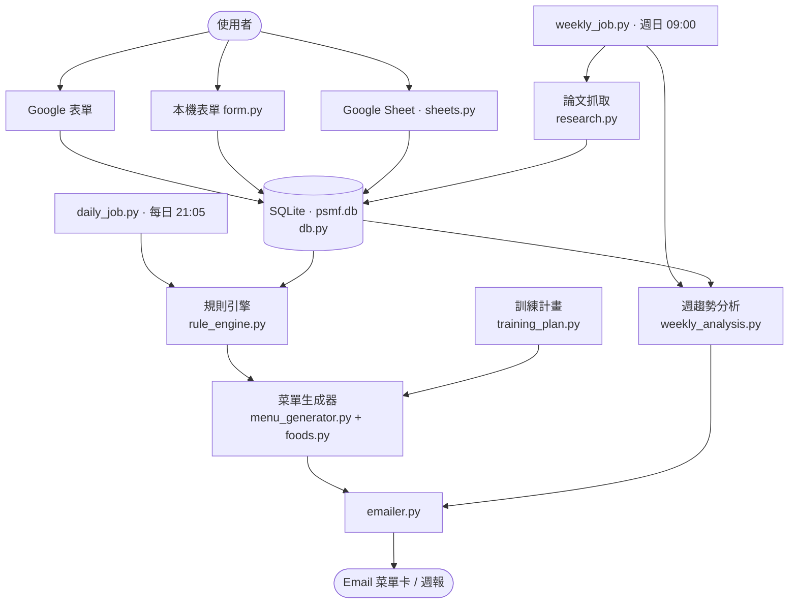

# PSMF-Coach

> 自動化的 PSMF（蛋白質節約型減脂）個人教練系統範本：每日動態菜單卡 + 週日論文/趨勢自動更新，純 Python 零月費。

**Author**: [@Lee-unhn](https://github.com/Lee-unhn) · a2264563@gmail.com

  
  
  
  

<a href="README.en.md">English</a> | <b>中文</b>

## 專案簡介 / Overview

PSMF-Coach 是一套自架的 PSMF（極低熱量蛋白質節約減脂法）個人教練自動化範本：每天回填體重/狀態 → 規則引擎決定隔日日型 → Gemini 或 template 生成完整菜單卡 email；每週日自動抓 PubMed/Europe PMC 最新論文、重算 TDEE、寄 HTML 週報。純 Python + SQLite + 免費 API（Gemini 免費額度、Gmail SMTP、Windows 工作排程），零月費。

> ⚠️ 醫療免責聲明：PSMF 是極低熱量飲食（VLCD），開始前請諮詢醫師並做基線抽血。本專案為衛教/資訊工具，不是醫療建議。詳見原 README。

## 架構 / Architecture

## 技術棧 / Tech Stack

- Python 3.12
- SQLite（`db.py`）做資料持久化
- Gemini 免費額度（菜單與週報 LLM）
- PubMed / Europe PMC / Semantic Scholar 免費 API（論文抓取）
- Gmail SMTP（`emailer.py`）寄信
- Google Sheets / 本機 HTML 表單（三種回填方式並存）
- Windows 工作排程（`install_autostart.py`）每日 21:05 + 週日 09:00

## 主要檔案 / Key Files

- `config.py` — 全域設定與門檻
- `db.py` — SQLite schema、回填與菜單記錄
- `rule_engine.py` — 規則引擎，根據近期趨勢決定隔日日型（A/B/碳水回補/飲食假期）
- `menu_generator.py` + `foods.py` — 食材庫組菜單、算 macros 與價格
- `daily_job.py` / `weekly_job.py` — 每日與週日的入口腳本
- `research.py` + `weekly_analysis.py` — 論文抓取與趨勢分析（重算 BMR/TDEE）
- `emailer.py` — HTML 菜單卡 / 週報寄送
- `verify_setup.py` / `install_autostart.py` — 環境驗證與 Windows 排程安裝

## 使用 / Usage

詳細步驟見 [`SETUP.md`](SETUP.md)。基本流程：

1. `pip install -r requirements.txt`
2. 複製 `.env.example` 為 `.env` 並填入 Gemini key / Gmail SMTP / 個人基線資料
3. `python init_baseline.py` 初始化 SQLite
4. `python verify_setup.py` 驗證環境
5. `python install_autostart.py` 安裝 Windows 工作排程（每日 21:05 + 週日 09:00）

互動版架構圖：[`docs/architecture.html`](docs/architecture.html)（5 分頁，含心智圖）。

## License

MIT — 詳見 [`LICENSE`](LICENSE)。
